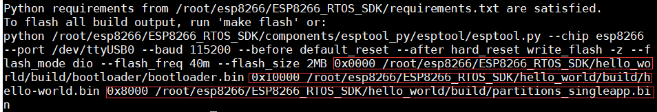
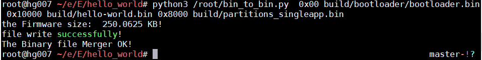
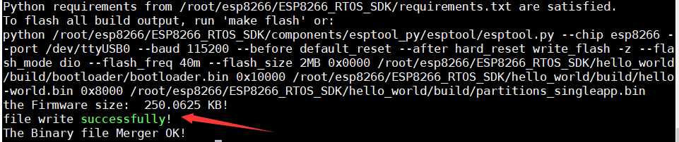

# #ESP32/8266 编译二进制文件连接工具
## ./bin_to_bin.py
### 基于python3(在python3下测试的,用Python2运行的话可能会出现一些莫名其妙的错误)

使用官方的SDK开发ESP32/8266时，编译会生成多个二进制文件,通常还会将这些二进制文件烧录到特定的flash地址。如下图

有点麻烦，于是用python写了个小脚本，将多个二进制文件拼接成一个，然后就只需要将它烧录到0X00地址就OK啦！
### 使用说明：
```python
    #python3 .../bin_to_bin.py 地址0 文件0路径 地址1 文件1路径 地址2 文件2路径 ...
```
地址和文件必须一一对应且地址在前，文件数量可为一个或多个不定，但传参时必须按上述格式。

eg:
```python
python3 /root/bin_to_bin.py  0x00 build/bootloader/bootloader.bin 0x10000 build/hello-world.bin 0x8000 build/partitions_singleapp.bin
```
这里我是把bin_to_bin.py扔到了root下，实际调用时填你自己的目录就OK。

脚本会计算最终固件的大小并输出

看到successfully!说明文件连接成功。
在调用此脚本的当前目录下会生成一个叫out.bin的文件，它就是连接后的文件。

也可以在make编译时让脚本自动运行，
这需要在官方SDK包里修改一个配置文件，这里我用的包是ESP8266_RTOS_SDK
```c
//文件路径  .../ESP8266_RTOS_SDK/make/project.mk
//打开文件，在第327行下面添加：
  python3 /root/bin_to_bin.py $(ESPTOOL_ALL_FLASH_ARGS)
```
注意，这里的bin_to_bin.py路径需要修改为你自己所在的目录。

然后在工程文件夹下执行make后

连接后的文件会生成在工程文件夹目录下。
看到successfully!就OK啦。
